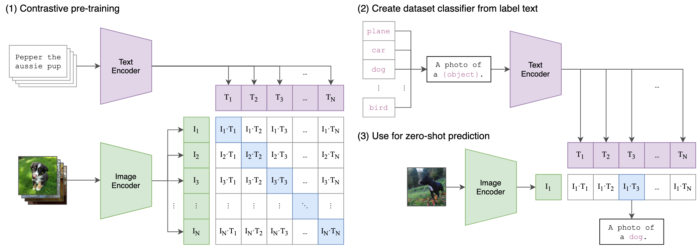

# Learning Transferable Visual Models From Natural Language Supervision


## ✨Introduction

> **Abstract**: State-of-the-art computer vision systems are trained to predict a fixed set of predetermined object categories. This restricted form of supervision limits their generality and usability since additional labeled data is needed to specify any other visual concept. Learning directly from raw text about images is a promising alternative which leverages a much broader source of supervision. We demonstrate that the simple pre-training task of predicting which caption goes with which image is an efficient and scalable way to learn SOTA image representations from scratch on a dataset of 400 million (image, text) pairs collected from the internet. After pre-training, natural language is used to reference learned visual concepts (or describe new ones) enabling zero-shot transfer of the model to downstream tasks. We study the performance of this approach by benchmarking on over 30 different existing computer vision datasets, spanning tasks such as OCR, action recognition in videos, geo-localization, and many types of fine-grained object classification. The model transfers non-trivially to most tasks and is often competitive with a fully supervised baseline without the need for any dataset specific training. For instance, we match the accuracy of the original ResNet-50 on ImageNet zero-shot without needing to use any of the 1.28 million training examples it was trained on. We release our code and pre-trained model weights at https://github.com/OpenAI/CLIP.




## 📋TODO List

- [x] Initialize this project
- [x] Implement image and text encoders (via `transformers`)
- [x] Implement CLIP training loss
- [x] Implement CLIP trainer
- [ ] Support distributed training.

## 🧑‍💻Implementation


### CLIP Loss

Basically, CLIP employs a symmetric InfoNCE loss, including image-to-text and text-image direction.

```python
class ClipLoss(nn.Module):
    """CLIP contrastive learning loss (Symmetric InfoNCE loss).

    Core Idea: Pull paired (image, text) features closer together while
        pushing unpaired samples apart.

    Workflow:
    1. Apply L2 normalization to `image_features` and `text_features`.
    2. Calculate image-text similarity matrix: `logits = (I @ T.T) * logit_scale.exp()`, with shape `[N, N]`.
    3. Image-to-text direction: `loss_i = CrossEntropy(logits, torch.arange(N))`
    4. Text-to-image direction: `loss_t = CrossEntropy(logits.T, torch.arange(N))`
    5. Return average loss of two direction.
    """

    def __init__(self, gather_with_grad: bool = False, local_loss: bool = False):
        super(ClipLoss, self).__init__()
        self.gather_with_grad = gather_with_grad
        self.local_loss = local_loss
        self.loss = nn.CrossEntropyLoss()

    def forward(
        self,
        image_features: torch.Tensor,
        text_features: torch.Tensor,
        logit_scale: torch.Tensor,
    ) -> torch.Tensor:
        """Calculate symmetric contrastive loss.

        Args:
            image_features (torch.Tensor): Unnormalized Image features, of shape (N, D)
            text_features (torch.Tensor):  Unnormalized Text features, of shape (N, D)
            logit_scale (torch.Tensor):    Temperature on a log scale.
        Returns:
            torch.Tensor: Scalar loss
        """
        N = image_features.size(0)

        # 1. Normalize image and text features
        image_features = image_features / image_features.norm(p=2, keepdim=True)
        text_features = text_features / text_features.norm(p=2, keepdim=True)

        # 2. Calculate cosine similarity matrix
        logits = (image_features @ text_features.t()) * logit_scale.exp()  # (N, N)

        # 3. Symmetric InfoNCE loss
        labels = torch.arange(N)
        loss_i = self.loss(logits, labels)
        loss_t = self.loss(logits.t(), labels)
        loss = (loss_i + loss_t) / 2
        return loss
```

## 👏Acknowledgement

This project is built upon official implementation of [CLIP](https://github.com/OpenAI/CLIP). Thanks for their excellent work!
